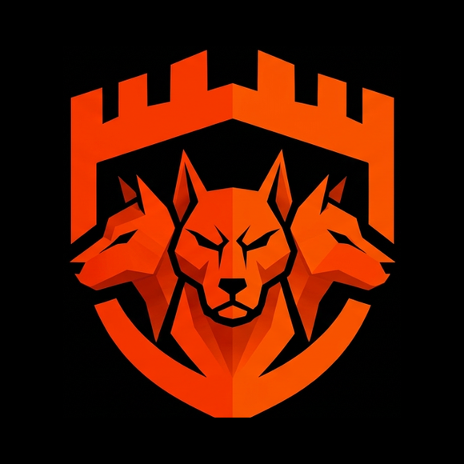

# Cerberus

**Continuous Security Testing Platform**

AI-driven agents that autonomously pentest, review code, verify exploits, 
and auto-fix vulnerabilities.

---

## What is Cerberus?

Cerberus is an **AI-powered security platform** built by Ledger Donjon that continuously tests your infrastructure and codebase for vulnerabilities. Instead of one-off manual pentests, Cerberus deploys autonomous AI agents that explore, analyze, verify, and remediate security issues — then report back with structured findings and evidence.

 

## Tech Stack

 

---

Built by Ledger Donjon — the security research team at [Ledger](https://www.ledger.com/)

